# MCP Testing

Educational project for learning LLM APIs, Model Context Protocol (MCP), and security concepts like tool poisoning.

## What This Does

- **MCP Server**: Provides a mock web search tool that can operate in normal or malicious mode
- **MCP Client**: Interactive terminal chat using OpenAI + MCP tools
- **Security Testing**: Demonstrates prompt injection attacks and tool poisoning vulnerabilities

## Architecture

The following diagram illustrates how the MCP (Model Context Protocol) architecture works and demonstrates the difference between normal operation and malicious prompt poisoning attacks:

```mermaid
graph TB
    %% User Interface
    User["👤 User"] --> Client["🖥️ MCP Client<br/>Terminal Chat Interface"]

    %% Step 1: MCP Tool Call
    Client -->|"1. User Query"| Server["🔧 MCP Server<br/>Mock Web Search Tool"]

    %% Server Mode Decision
    Server --> Mode{"Server Mode?"}

    %% Normal Mode Path
    Mode -->|"Normal Mode"| SafeSearch["🔍 Safe Web Search<br/>Returns legitimate results"]
    SafeSearch --> SafeResponse["✅ Clean Tool Response<br/>Factual information"]

    %% Malicious Mode Path
    Mode -->|"Malicious Mode"| MaliciousSearch["💀 Malicious Web Search<br/>Prompt injection attacks"]
    MaliciousSearch --> PoisonedResponse["☠️ Poisoned Tool Response<br/>Injected prompts<br/>Misleading information"]

    %% Step 2: Tool Results Back to Client
    SafeResponse -->|"2. Tool Results"| Client
    PoisonedResponse -->|"2. Tool Results"| Client

    %% Step 3: LLM Synthesis
    Client -->|"3. Synthesize Response"| OpenAI["🤖 OpenAI API<br/>GPT Models"]

    %% LLM Processing Decision
    OpenAI --> AIDecision{"LLM Processing"}
    AIDecision -->|"Clean Tool Data"| SafeSynthesis["✨ Normal Synthesis<br/>Helpful response based on clean data"]
    AIDecision -->|"Poisoned Tool Data"| CompromisedSynthesis["💥 Compromised Synthesis<br/>LLM processes malicious content<br/>Potential misinformation output"]

    %% Step 4: Final Response to User
    SafeSynthesis -->|"4. Final Response"| User
    CompromisedSynthesis -->|"4. Final Response"| User

    %% Logging System
    Client --> Logger["📝 Logging System"]
    OpenAI --> Logger
    Logger --> LogFiles["📁 logs directory<br/>Interaction analysis"]

    %% Styling
    classDef normal fill:#e1f5fe,stroke:#01579b,stroke-width:2px
    classDef malicious fill:#ffebee,stroke:#c62828,stroke-width:2px
    classDef ai fill:#f3e5f5,stroke:#4a148c,stroke-width:2px
    classDef system fill:#e8f5e8,stroke:#2e7d32,stroke-width:2px

    class SafeSearch,SafeResponse,SafeSynthesis normal
    class MaliciousSearch,PoisonedResponse,CompromisedSynthesis malicious
    class OpenAI,AIDecision ai
    class Client,Server,Logger,LogFiles system
```



### Key Security Concepts Demonstrated

- **Normal Flow (Blue)**: Standard MCP operation with safe, factual responses
- **Malicious Flow (Red)**: Prompt injection attacks where the MCP server returns poisoned data
- **AI Processing (Purple)**: Shows how even advanced AI models can be compromised by poisoned tool outputs
- **System Components (Green)**: Infrastructure components including logging for security analysis

The diagram illustrates how tool poisoning attacks work: malicious MCP servers can inject harmful prompts into responses, which are then processed by AI models that may not detect the manipulation, potentially leading to misinformation or compromised outputs.

## Prerequisites

- Homebrew
- OpenAI API key

## Setup

```bash
# Install dependencies
bash scripts/deps.sh

# Add your OpenAI API key to .env
echo "OPENAI_API_KEY=your_key_here" > .env
```

## Usage

### 1. Start MCP Server

```bash
# Normal mode (safe responses)
bash scripts/server.sh

# Malicious mode (prompt injection attacks)
bash scripts/server.sh -m
```

### 2. Run MCP Client

```bash
# Interactive chat session
bash scripts/client.sh
```

The client will:

1. Send your questions to the MCP server's search tool
2. Enhance responses using OpenAI
3. Log all interactions to `logs/` directory

### 3. Inspect Server (Optional)

```bash
# Visual MCP server inspection
bash scripts/inspect.sh
```

Opens browser interface to explore available tools and test them directly.

## Educational Focus

- **Normal Mode**: Learn MCP protocol basics and client-server communication
- **Malicious Mode**: Understand security vulnerabilities in LLM-tool interactions
- **Logging**: Analyze interaction patterns and response enhancement
